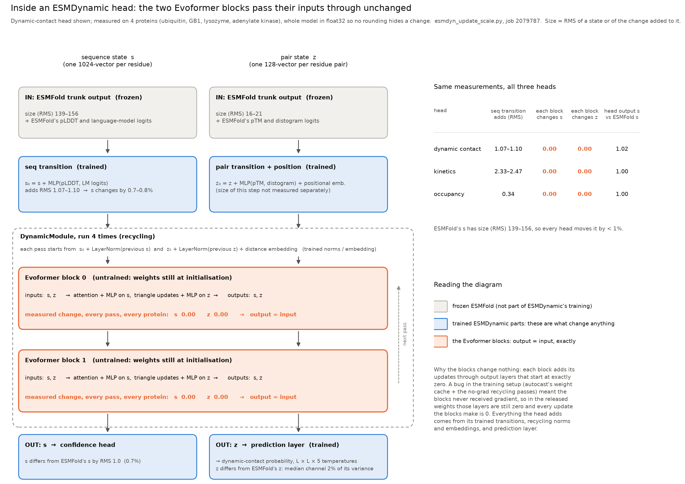
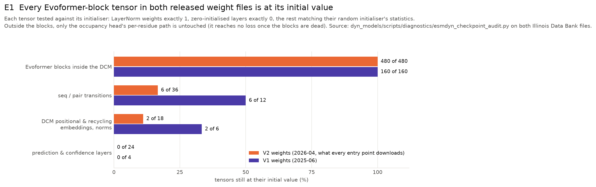
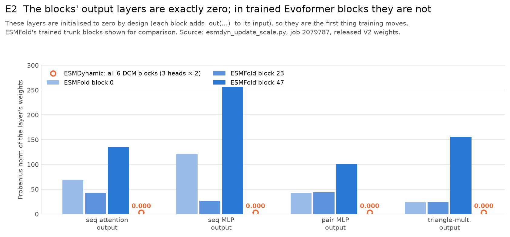
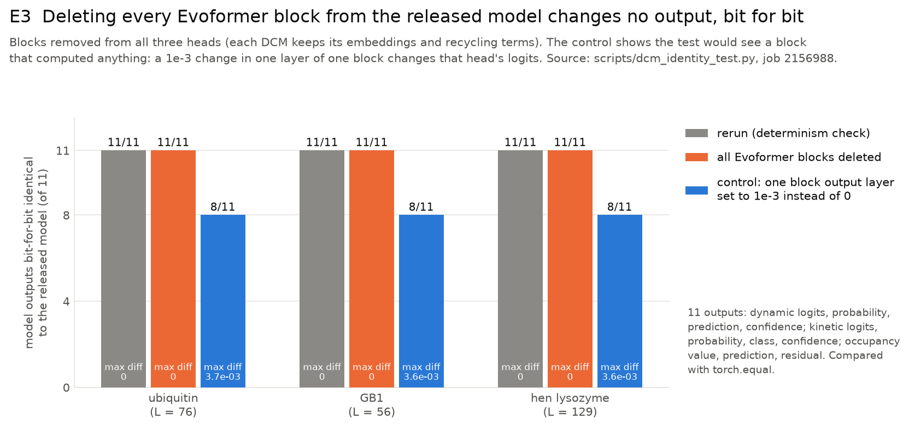
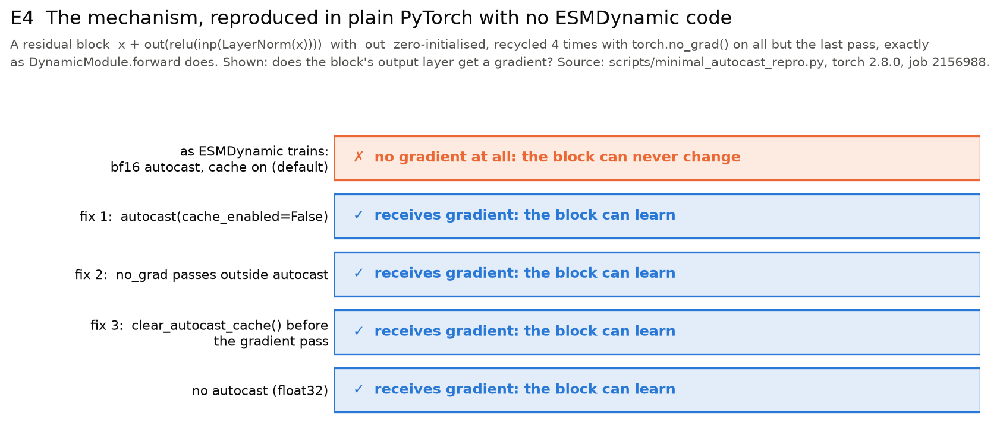
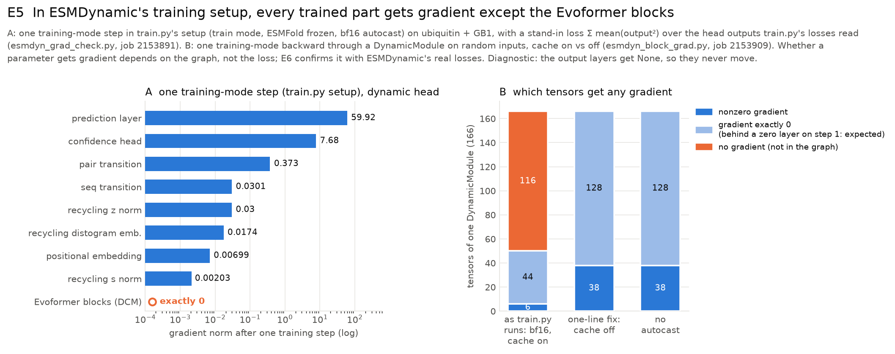
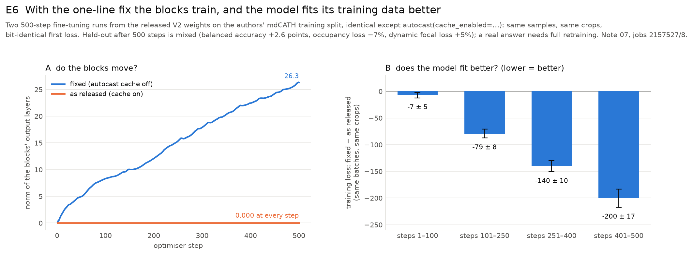
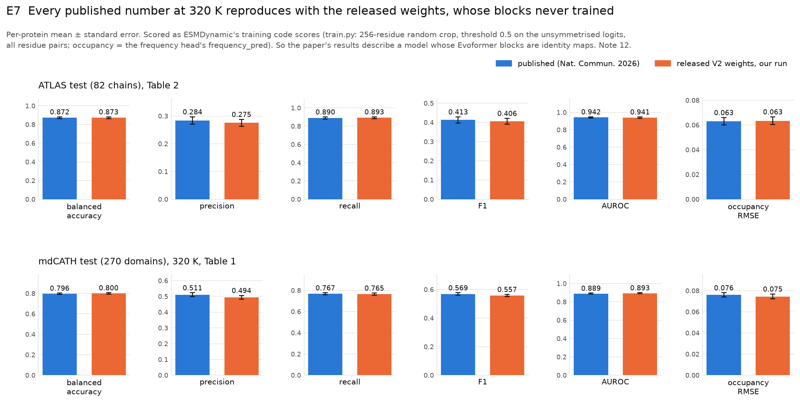
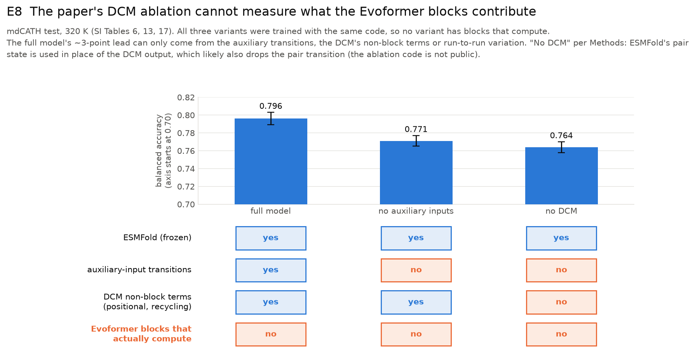

# ESMDynamic's Dynamic Contact Module blocks were never trained: the evidence

Compiled 2026-10-06 on branch `investigate/dynamicmodule-untrained` of `polowish/esmdynamic`.
Paper: Kleiman, Feng, Xue & Shukla, "ESMDynamic: Fast and accurate prediction of protein dynamic
contact maps from single sequences", *Nature Communications* (2026) 17:9623, doi 10.1038/s41467-026-76361-2
(preprint bioRxiv 10.1101/2025.08.20.671365). Code: `ShuklaGroup/esmdynamic` at `b3c7f04`.
Weights: Illinois Data Bank IDB-3773897 / IDB-0355017.

## The finding in five lines

1. Each of ESMDynamic's three heads contains a Dynamic Contact Module (DCM) with two
   Evoformer blocks. **In both released weight files, every parameter of every block is
   still at its initial value** (E1, E2).
2. Because the blocks' output layers start at zero, untrained blocks are identity maps:
   **deleting them leaves every model output bit-for-bit identical** (E0, E3).
3. **Cause: a PyTorch autocast weight-cache interaction in the training code.** The DCM
   runs its first recycling passes under `torch.no_grad()` inside a bf16 `autocast` region;
   autocast caches the blocks' low-precision weight copies on that no-grad pass, and the
   gradient pass reuses them, so the blocks never receive gradient (E4, E5).
   `autocast(cache_enabled=False)` fixes it, and the blocks then train (E6).
4. **The published results come from these weights**: all six 320 K metrics in Tables 1–2
   reproduce with the released file (E7). They describe ESMFold plus the heads' shallow
   trained parts, not a model with working Evoformer blocks.
5. The paper lists the DCM as trainable (SI Table 5: 28.6 M parameters) and concludes that
   "a dedicated DCM does improve the performance"; its ablation **cannot test that claim**,
   because no variant had blocks that computed (E8).

## What the paper says

- Methods / Fig. 1C: three heads, each with a "Dynamic contact module … Evoformer (2 blocks)"
  between ESMFold's outputs and the prediction layer.
- SI Table 5: "Dynamic Contact Module (3X) 28,600,448 — Trainable: Yes", including "Evoformer
  (2X) 14,293,888". The trainable total, 95,894,843, is exactly the count of head parameters
  with `requires_grad=True` in the released code.
- Results: "the addition of auxiliary features and a dedicated DCM does improve the
  performance, indicating the need for additional parameters to correctly predict difficult
  examples."
- Precision is never mentioned (no "bf16", "mixed precision" or "autocast"); `train.py`
  runs the forward pass under `torch.autocast(dtype=torch.bfloat16)`.

## The evidence

### E0 · What a head does at inference



One head's forward pass with the size of every change, on four proteins in float32. The
Evoformer blocks receive the sequence state `s` and pair state `z` and return them
unchanged at every recycling pass. All of the head's effect on the state comes from the
trained parts around the blocks. Source: `dyn_models/scripts/diagnostics/esmdyn_update_scale.py`, job 2079787.

### E1 · The block weights are at their initial values, in both releases



480 of 480 block tensors in V2 (2026-04), 160 of 160 in V1 (2025-06). LayerNorm weights
are exactly 1, zero-initialised layers exactly 0, and the remaining matrices match their
random initialiser's statistics. Outside the blocks, everything trained except the occupancy
head's per-residue path (its sequence transition and recycling s-norm), which reaches no
loss once the blocks are dead (see the flowchart, `figures/gradient_flow/02_gradient_flowchart.png`). Source:
`dyn_models/scripts/diagnostics/esmdyn_checkpoint_audit.py`.

### E2 · The blocks' output layers are exactly zero



Each block adds `out(…)` to its input, and `out` is zero-initialised so that a new block
starts as the identity. Training moves these layers first; in ESMFold's trained trunk
their norms are 23–256. In all six ESMDynamic blocks they are 0.000. Source: job 2079787.

### E3 · Deleting the blocks changes nothing, bit for bit



All 11 outputs of all three heads compared with `torch.equal`, on three proteins: with
every block deleted, 11 of 11 are identical, the same as a plain rerun. A control that
sets one block output layer to 1e-3 changes that head's logits, so the test would detect
a block that computed anything. Note 05, `scripts/dcm_identity_test.py`.

### E4 · The mechanism, in plain PyTorch



A small residual block, recycled as `DynamicModule.forward` recycles it. Under one bf16
autocast region with the default cache, the block gets no gradient at all; each of three
one-line fixes restores it. Same result with float16. Note 04,
`scripts/minimal_autocast_repro.py`, torch 2.8.0 (the version the install instructions pin).

### E5 · In ESMDynamic's training setup, only the blocks get no gradient



A: one training-mode step in `train.py`'s setup (train mode, ESMFold frozen, bf16 autocast)
from the released weights, on two real proteins (ubiquitin, GB1), with a stand-in loss
(Σ mean(output²) over the head outputs `train.py`'s losses read): every trained component
gets gradient, the blocks exactly none. Whether a parameter gets gradient depends on the
graph, not on the loss; E6 confirms the result with ESMDynamic's real losses. This is one
step, so the LayerNorms' zeros would be normal for a first step; what is diagnostic is that
the output layers get no gradient at all, so they can never leave zero. B: one training-mode backward through a DCM on random inputs: 116 of its 166 tensors (every
block Linear) are not in the autograd graph at all with the cache on; with it off, all are. Sources:
`dyn_models/scripts/diagnostics/esmdyn_grad_check.py` (job 2153891), `esmdyn_block_grad.py`
(job 2153909).

### E6 · With the fix, the blocks train



Two 500-step fine-tuning runs from the released weights on the authors' mdCATH training split
(data the released heads were already trained on), identical (same samples, same crops,
bit-identical first loss) except `cache_enabled`. As released, the blocks stay at
0.000; fixed, their output layers grow to 26.3 and the model fits its training data ~6% better
(training loss, paired by batch).
The held-out effect of 500 steps is mixed (balanced accuracy +2.6 points, occupancy loss
−7%, focal loss +5%), so whether trained blocks generalise better needs a proper
retraining. Note 07.

### Scope · Every public route loads the same untrained weights

| entry point | weights it loads |
|---|---|
| `esm.pretrained.esmdynamic()`, `run_esmdynamic`, Dockerfile | Data Bank datafile `7odsk` (`esmdynamic_model_weights_V2.pt`, 383,731,643 bytes, sha256 `b41a1a22e9afd664…`) |
| Colab notebook | the same file, via `aria2c` |
| V1 release (2025-06, `jx4ui`) | not loaded by current code; its blocks are untrained too |

The bug's two ingredients (bf16 autocast in `train.py`, `no_grad` recycling in
`dynamic_module.py`) are present in the June 2025 code and unchanged since (note 02). Our
install is the official file with the checksum above and upstream code (note 03).

### E7 · The published numbers come from these weights



Scored the way the training code scores (256-residue random crop, threshold 0.5 on the
unsymmetrised logits, all residue pairs, per-protein mean ± se), the released weights
reproduce all six ATLAS metrics of Table 2 within one standard error and all six mdCATH
320 K metrics of Table 1 within ~1.5. Other readings (full length, symmetrised) land within
~1 point. Note 12.

### E8 · The ablation cannot measure the blocks



The full model leads "no auxiliary inputs" and "no DCM" by ~3 points, and the two ablations
differ by less than their standard errors. All three were trained with the same code, so
the DCM in the full and no-aux models never had working blocks, and per E3 the blocks
contribute nothing. Whatever the lead reflects, it is not the Evoformer blocks: the
auxiliary transitions, the DCM's positional and recycling terms (which "no DCM" removes
along with the blocks), or run-to-run variation. Note 09.

## What this does and does not mean

- **It does not mean the published numbers are wrong.** They reproduce. The released
  model is a working predictor; it is ESMFold's pair state, plus trained transitions of
  ESMFold's auxiliary outputs and a few trained embeddings, fed to a linear readout.
- **It does mean the model is not the one described.** The Evoformer blocks presented as
  the core of each head, and counted as 28.6 M trained parameters, do nothing, and the
  claim that the DCM improves performance is not supported by the ablation.
- **It is fixable in one line**, but the heads need retraining to know what working blocks
  add. Our 500-step check shows they learn and fit the training data better; it is too
  short to say whether they generalise better.
- **For representation work** (dyn_models): the heads' single-sequence states differ from
  ESMFold's trunk state by < 1%, so ESMDynamic's "dynamics-trained" per-residue
  representations are ESMFold's, in effect.

## Suggested fix

```python
# esm/esmdynamic/training/train.py, both autocast calls
with torch.autocast(device_type=device, dtype=torch.bfloat16,
                    enabled=autocast_enabled, cache_enabled=False):
```

Equivalent: run the DCM's `no_grad` recycling passes outside the autocast region, or call
`torch.clear_autocast_cache()` before the gradient pass. Separately, the shipped `train.py`
cannot run against the current model code: `forward`'s native-contact step (added
2026-02-25) calls `.numpy()` on tensors that require grad.

## Questions for the authors

1. Were the published models (and the ablation variants) trained with the released
   `train.py`, bf16 autocast on? Is there any internal checkpoint whose blocks moved?
2. Which protocol produced Tables 1–2 and SI Tables 6–7? Ours matches best with the
   training code's crop-and-logits path.
3. At 348–450 K, SI Table 6's precision, recall and F1 match ours to the third decimal, but
   balanced accuracy and AUROC do not (450 K: 0.542 vs 0.753). The implied specificity is
   0.09 against our 0.51. How were negatives counted for those two metrics? (Note 12.)
4. Could the ablation code be shared? "No DCM" as described likely also drops the pair
   transition, which would make it a different comparison from the one in the text.

## Reproducing this

Each figure is drawn by `python investigation/scripts/plot_evidence.py` (E1–E8) and
`python dyn_models/scripts/diagnostics/plot_esmdyn_update_scale.py` (E0) from the results
in `investigation/results/` and the job numbers embedded in the scripts. The GPU checks
(`dcm_identity_test.py`, `minimal_autocast_repro.py`, `short_training_check.py`,
`eval_protocol.py`) ran on one NVIDIA L40S with torch 2.8.0+cu129. Write-ups per check
are in `investigation/notes/01`–`12`.
